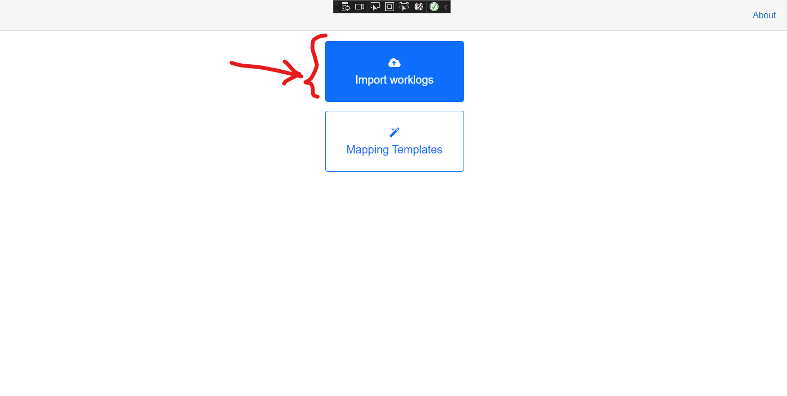
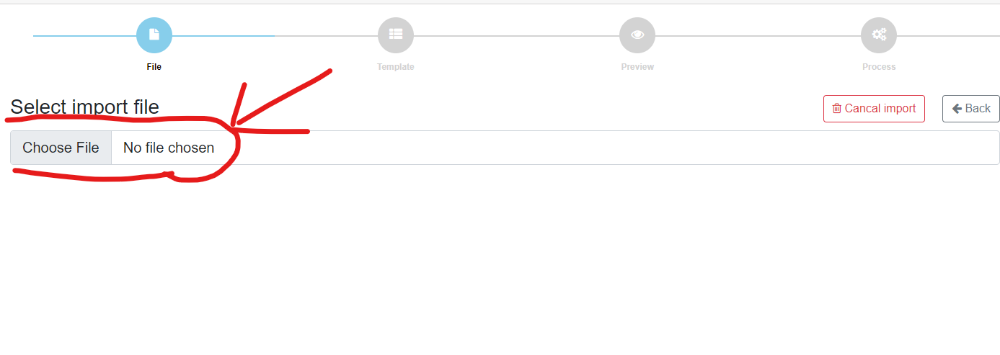
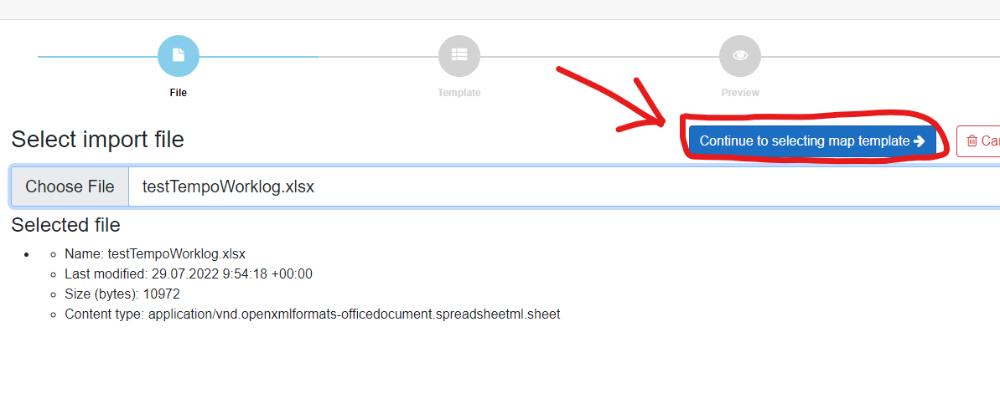
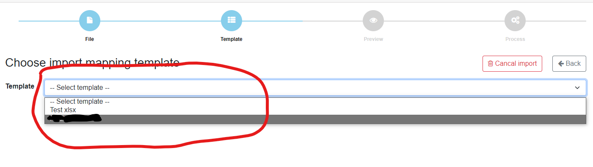
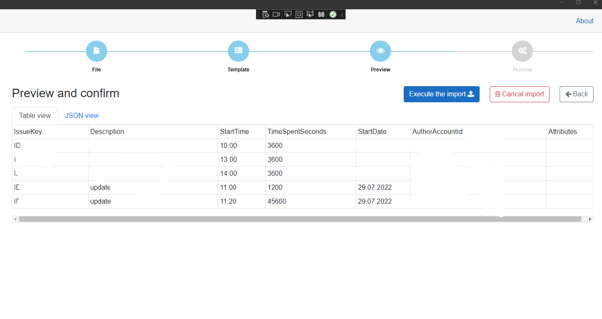
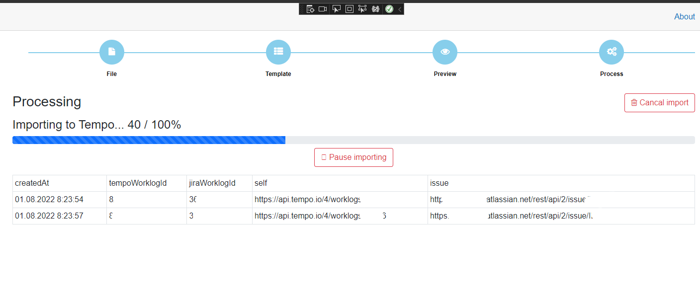
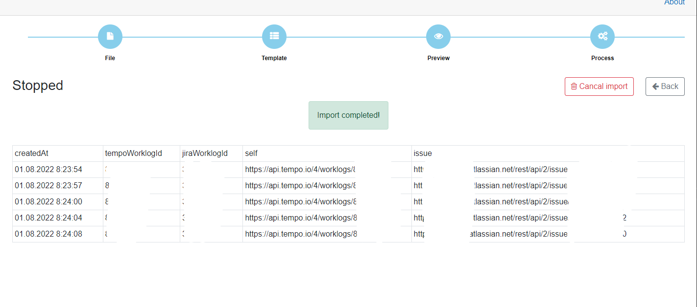

# Importing worklogs Excel file to Tempo

> You havo create the Mapping template fisrt, then you can run the import.

Go to Import section:

Select your file:

After selecting the file, you will se the file info and new button to continue to the next step:

In this step, you will select the mapping template that will be used to read the selected file in the previus step.
Note that if you have only one mapping template, it will be selected by default.

Select the mapping template and check the mapping template settings after selecting it:

Check the selected mapping tewmplate and click on the new displayd button to go to the next step:

Now, you will see the result of the data, that was extracted using the mapping template from the selected file.
You can switch between the table view and the JSON view.
> The json code is representing how the data is sent to the Tempo API

After checking the data, you can confirm and run the import by clicking on the "Execute the import" button:

Import will send the data to the Tempo API one by one and you will see the process results immediately:

> If an error occurred, you will see red row and the reason message with more details.

After the import is completed, the progress bar will hide and message about the completion is displayed:

