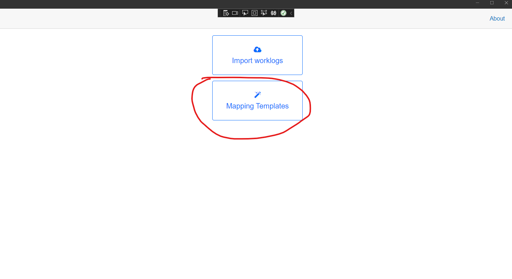
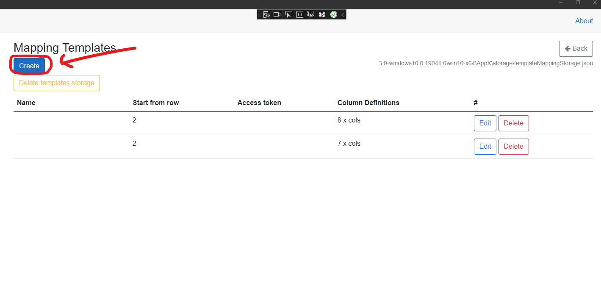
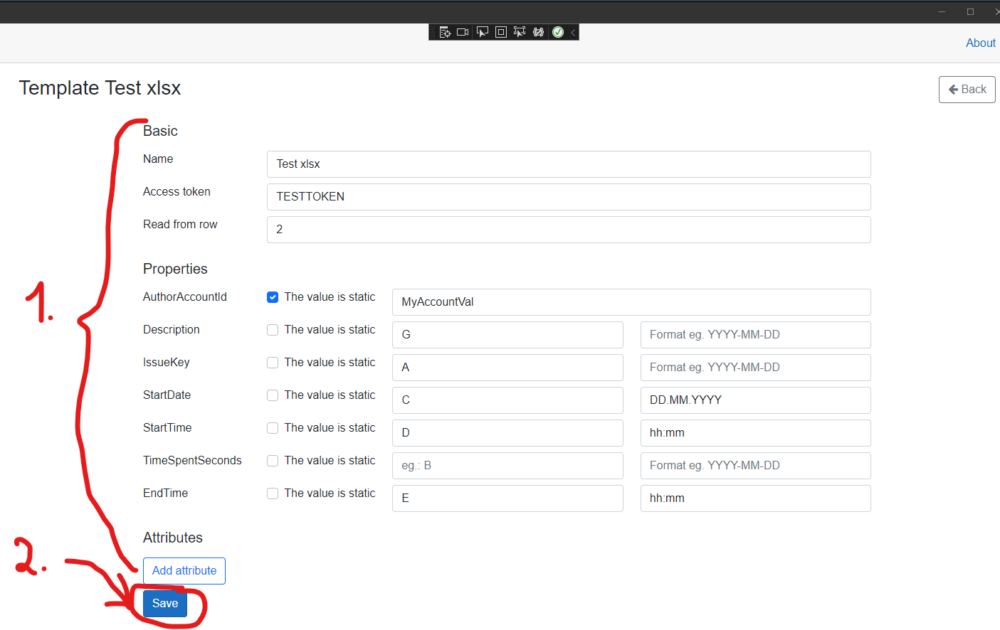

# Mapping templates

these templates define, how the content of the imported file will be mapped to the Tempo data model. It means template is the place, where we are telling the program (TempoWorklogger) that the imported Excel file has column B witch is for example the Issue Key and also it has and column C witch is the description...etc. These templates is stored and when we importing a data, we always selecting the template, witch will be used to read the file and map the rows to the Tempo model.

## Creating the new mapping template

Go to Mapping templates section:

Click on Create button:

Fill the informations and click on Save:

easy peasy